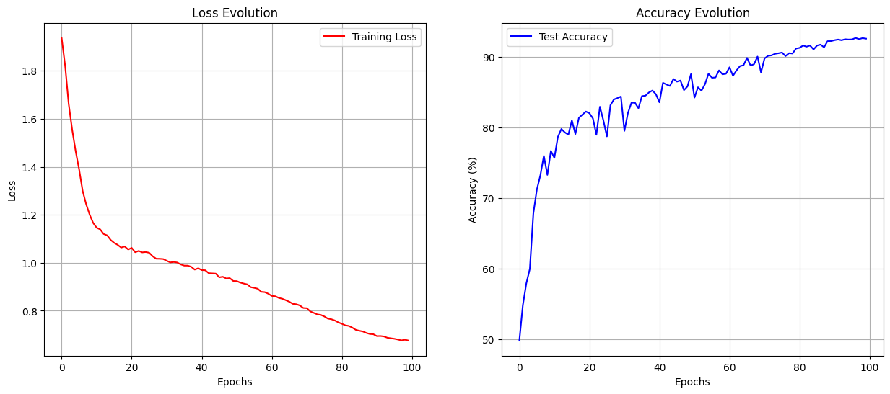

# Custom-Neural-Nets-on-CIFAR
Implementing custom neural network architectures from scratch on the CIFAR datasets

## Overview
This repository explores custom implementations of convolutional neural networks (CNNs), including architectures inspired by VGG and ResNet, trained on the CIFAR-10 and CIFAR-100 datasets.

The goals of the project are:
1. Understand how popular deep learning architectures are built from first principles.
2. Study how hardware limits (GPU memory, batch size, training time) influence model performance.

## Motivation
This project is part of my ongoing learning process in deep learning and neural network architecture design.
I aim to build models manually, experiment with deeper structures, and analyze how training behaves under different constraints.

## Repository Structure
| File / Directory        | Description                                                         |
|-------------------------|---------------------------------------------------------------------|
| `/data/`                | Scripts and notebooks for data download and preprocessing           |
| `simple_models.ipynb`   | Baseline models and initial experiments                            |
| `vgg-notebook.ipynb`    | VGG-style architecture implementation from scratch                 |
| `vgg-notebook_100.ipynb`| Extended VGG experiment with deeper layers                         |

## Key Features
- Custom CNN architectures implemented manually.
- Comparison of baseline, VGG-style, and residual-inspired architectures.
- Experiments involving:
  - Hardware limitations
  - GPU memory constraints
  - Batch size and epoch variation
  - Data augmentation
- Visualization of training curves:
  - Loss
  - Accuracy
  - Overfitting and generalization behaviour

## Requirements
- Python 3.x
- NumPy
- Matplotlib
- PyTorch
- Jupyter Notebook
- Optional GPU support

## Usage
### 1. Clone repository
```bash
git clone https://github.com/aditudor30/Custom-Neural-Nets-on-CIFAR.git
cd Custom-Neural-Nets-on-CIFAR
```

### 2. Install dependencies
```bash
pip install -r requirements.txt
```

### 3. Run notebooks
```bash
jupyter notebook
```

## Experimentation Ideas
- Implement a ResNet-style architecture with skip connections. (completed)
- Compare performance on CIFAR-10 vs CIFAR-100.
- Perform hyperparameter tuning.
- Add regularization (dropout, batchnorm, weight decay). (completed)
- Test behaviour on limited hardware. (almost completed)

## Results & Observations

### VGG-Style Architecture
Initial experiments with a VGG-based model achieved around **87% accuracy** on CIFAR-10 after 50 epochs. Increasing depth without skip connections caused instability and overfitting.

### ResNet-18 Architecture (Optimized)
By implementing a ResNet-18 architecture and adapting it for small images (removing the initial MaxPool and using a 3x3 kernel with stride 1), performance improved significantly.

To break the 90% barrier, the following strategies were applied:
1. **AutoAugment**: Essential for preventing the model from memorizing the training data.
2. **SGD with Momentum + Cosine Annealing**: Allowed the model to settle into a global minimum effectively in the final epochs.
3. **Extended Training**: 100 epochs were required to fully utilize the scheduler.

**Final Result:** **92.64% Accuracy** on CIFAR-10.


*Figure: Training Loss and Test Accuracy evolution over 100 epochs. Note the significant accuracy boost in the final 20 epochs as the Learning Rate decays.*

## Future Improvements
As we can see from the `vgg-notebook_100.ipynb`, our VGG-based model could not achieve the same performance on CIFAR-100.
Future work will focus on:
1. Adapting the optimized ResNet architecture for CIFAR-100.
2. Implementing Test Time Augmentation (TTA) to potentially squeeze out an extra 0.5% accuracy.
3. Experimenting with MixUp and CutMix regularization.

## License
This project is for educational purposes. You may fork, modify, or extend it freely.

